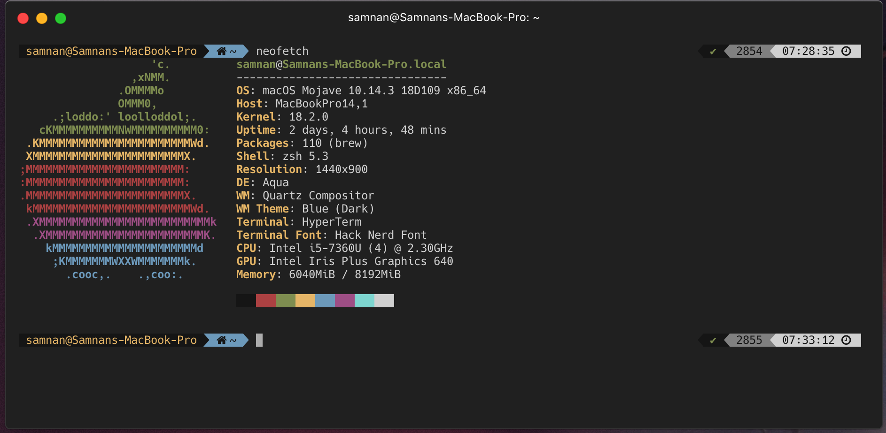
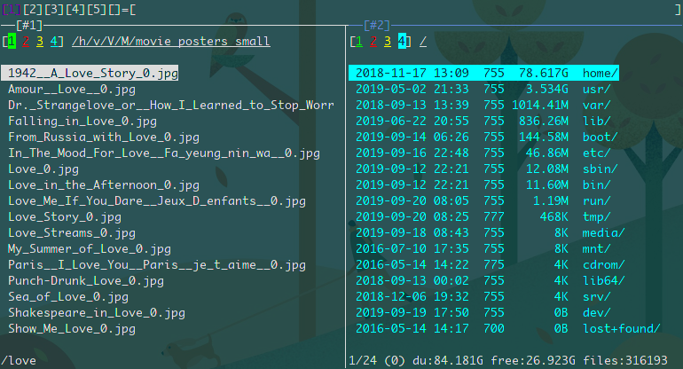
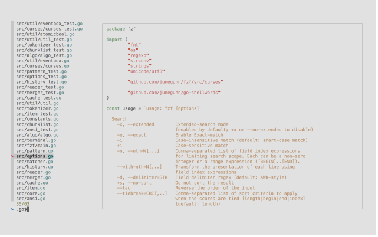

# Awesome utilities on macOS and Linux Terminal
[](http://perso.crans.org/besson/LICENSE.html)

```
This project isn't maintained anymore!
```

## installing necessary packages

1. clone the repository:

   ```bash
   sudo apt-get install git
   git clone https://github.com/Geektrovert/AwsTerm.git
   cd AwsTerm
   ```
   run installer script
   ```
   ./installer.sh
   ``` 
   or, run script manually according to your operating system
   ``` 
   # for macOS
   sudo chmod +x mac.sh
   ./mac.sh

   # for arch and arch linux based distros
   sudo chmod +x arch.sh
   ./arch.sh

   # for ubuntu alike debian based distros
   sudo chmod +x deb.sh
   ./deb.sh

   # for RHEL/Fedora User
   sudo chmod +x fedora.sh
   ./fedora.sh
   
   # for android Termux
   chmod +x termux.sh 
   ./termux.sh
   ```
   remove AwsTerm directory
   ```
   cd ..
   rm -rf AwsTerm
   ```

This shell file installs the following packages:

- [htop](https://hisham.hm/htop/)
- [bat](https://github.com/sharkdp/bat)
- [exa](https://github.com/ogham/exa)
- [fd](https://github.com/sharkdp/fd)
- [ripgrep](https://github.com/BurntSushi/ripgrep)
- [hexile](https://github.com/sharkdp/hexyl)
- [tig](https://github.com/jonas/tig)
- [thefuck](https://github.com/nvbn/thefuck)
- [httpie](https://httpie.org/)
- [asciinema](https://asciinema.org)
- [neofetch](https://github.com/dylanaraps/neofetch)
- [pstree](https://linux.die.net/man/1/pstree)
- [nnn](https://github.com/jarun/nnn)
- [aria2](https://github.com/aria2/aria2)
- [mc](https://github.com/MidnightCommander/mc)
- [mtr](https://github.com/traviscross/mtr)
- [pydf](https://linux.die.net/man/1/pydf)
- [lftp](https://linux.die.net/man/1/lftp)
- [fzf](https://github.com/junegunn/fzf)

## Updating and cleaning everything

    # for macOS
    brew update && brew upgrade && brew cleanup

    # for arch linux
    sudo pacman -Syyu

    # for ubuntu
    sudo apt-get update
    sudo apt-get upgrade

    # for Fedora
    sudo dnf update
    
    # for android termux 
    pkg update && pkg upgrade 

## Useful commandline utilities

1. Listing brew packages:

   - `brew list` - list all packages
   - `brew cask list` - list packages installed using caskroom
   - `brew leaves` - list all top-level packages
   - `brew deps --tree --installed` - list all packages with a nicely formatted
     dependency tree

2. Viewing config of homebrew: `brew config`

3. `bat filename` - '**bat**' is a modern replacement of '**cat**' which shows a
   source file on console with full syntax highlighting

   

4. Alternative to '**ls**' :

   - `exa` - list all files
   - `exa -la` - list all files including hidden files
   - `exa -laT` - list all files under current directory in a tree format

   

5. Find any directory : `fd search_keyword`

   

6. Advanve grep: `rg` (**ripgrep**) for finding strings among the files under
   current directory (_SSSHHHH, don't tell anyone, this is lighting fast!!!_)

   ```bash
   rg 'string to search'
   ```

   

7. Viewing a HEX file : `hexyl filename` - it shows the file in three columns in
   format: byte | hex | representation

   

8. HTTPie : a modern replacement of **curl**. It uses the following format :

   ```bash
   http POST link key=value
   ```

   

9. `pstree` command shows the running processes as a tree

   

10. **htop** is an interactive process viewer run by the command `htop`

    

11. `tig` for interactively browsing git repositories

    

12. You should give some fuck to your typos. So here it is, the legendary NSFW
    command `fuck`

    

13. `neofetch` command shows the system details

    

14. `nnn` is a full-featured terminal file manager.It's tiny,extremely light and
    fast.

    

15. `aria2` is an open source and free lightweight multi-protocol & multi-server
    command-line download utility.

    

16. `mc` gnu midnight commander is a feature rich visual file manager.

    

17. `mtr` is a simple command-line network diagnostic tool.

    

18. `pydf` is an advanced command line tool to display the amount of used and
    available disk space.

    

19. `lftp` is a sophisticated file transfer program supporting a number of
    network protocols (ftp,http,sftp,fish,torrent).

    

20. `fzf` is a general-purpose command-line fuzzy finder.It's an interactive
    Unix filter for command-line that can be used with any list; files, command
    history, processes, hostnames, bookmarks, git commits, etc.

    

## Love OpenSource

If this article is helpful to you, or you love this, just hit the star button :D

## References

This writing was hugely inspired from the blog posts of
[Darren Burns](https://github.com/darrenburns)
